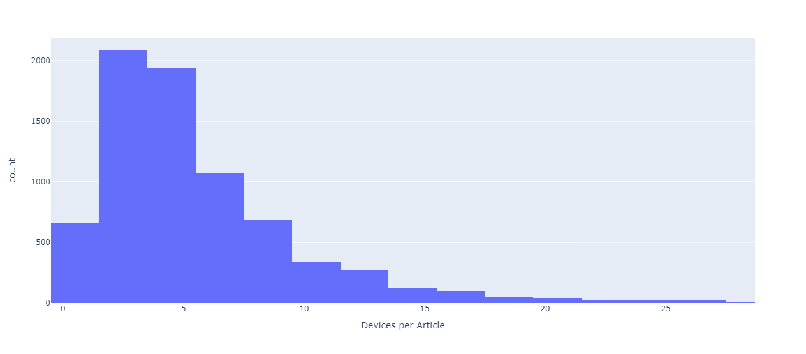
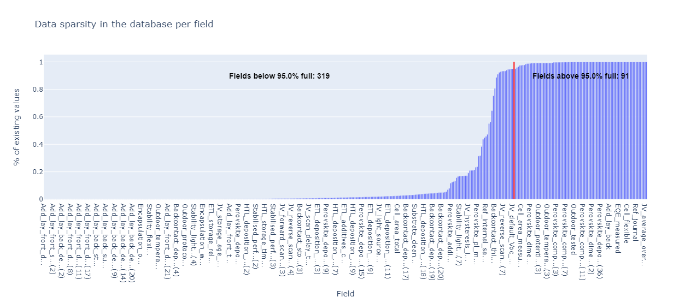

# Project Summary

## Project Overview

In this project, we've crafted a data extraction pipeline tailored to simplify the retrieval of experimental data from PDF documents. Our primary objective was to streamline the extraction process for a perovskite database, leveraging a predefined question protocol. The pipeline takes a PDF file's path as input and generates a structured CSV file containing the extracted experimental data.

### Perovskite Database

Our project places a specific emphasis on harvesting data related to perovskite materials, which hold substantial importance in materials science and energy research. Our objective is to swiftly and efficiently contribute data to the Perovskite Database. For more information, visit: [Perovskite Database](https://www.perovskitedatabase.com/)

## Pipeline and Module Description

### PDF Data Extraction Pipeline

Our data extraction pipeline comprises several pivotal components:

1. **Input PDF Parsing:** To begin, the pipeline parses the user-provided PDF document, focusing solely on textual content. As of now, it does not process graphical elements, images, or tables only the paper's text. According to our findings, each paper in the perovskite database has data points referring to around 5 devices on average. Thus, we have decided to focus on the best-performing device (AKA: 'champion device').

  

   

3. **Question Protocol:** We've harnessed the question protocol designed for the Perovskite database. Out of approximately 400 fields, we aim to populate around 70 using an AI model. This protocol serves as a blueprint for data extraction. Analyzing the database showed us that only 70 of the 400 fields are filled in 95% percent of the papers, thus we decided to prioritize them. That can be demonstrated below:

  

3. **Data Extraction:** Leveraging Natural Language Processing (NLP) techniques and regular expressions, we extract pertinent experimental data from the PDF documents, adhering to the question protocol. Currently, we utilize ChatGPT, with the aspiration of offering a choice among several Language Models (LMs) in future work, potentially integrating them into the module.

5. **Data Validation:** Extracted data undergoes thorough validation to ensure the consistency of the answers.

6. **CSV Output:** The pipeline's end product is a CSV file that houses the extracted data in a structured format, facilitating easy accessibility for further analysis and for evaluating the results.

# Conclusions

Having developed and implemented this data extraction pipeline, we've drawn several pivotal conclusions:

- **Automation:** Our pipeline has paved the way for automated data extraction from PDF documents, dramatically minimizing manual intervention and potential inaccuracies.

- **Data Standardization:** We've ensured that the harvested data is consistently formatted into a structured CSV, priming it for seamless integration into various databases, such as the perovskite database.

- **Accessing Papers:** During our endeavor, we recognized the absence of a standardized method to access paper PDFs. We often had to devise our own strategies, some of which could potentially infringe on copyrights. Resolving this issue is essential for anyone aiming to make paper-miner fully operational in the future.

- **Performance of GPT-3.5:** We observed that GPT-3.5's zero-shot capability wasn't up to the mark for data extraction, with a success rate of roughly 60% on average. However, it's worth noting that with the continuous advancement of OpenAI's LLMs, the performance of paper-miner is expected to improve organically without additional interventions.

## Future Directions

Looking ahead, we see multiple avenues for further enhancement:

- **Analysis of Images, Graphs, and Tables:** We are keen on augmenting our extraction capabilities to encompass data from images, graphs, and tables within the PDFs.

- **Fine Tuning:** To boost extraction proficiency, we're considering leveraging OpenAI's custom pre-training feature.

- **Exploring LLMs:** We aim to experiment with a variety of Large Language Models, contrasting their efficiency in data extraction tasks.

- **Supervised Learning Approach:** We're contemplating the integration of a supervised learning mechanism for better entity extraction from texts, using the Perovskite Database as a resource for tagged samples.

- **Integration:** A goal on the horizon is to connect our pipeline with prevalent materials science databases, fostering efficient data synthesis and study.

- **User Interface Development:** A more intuitive user interface is in the pipeline to cater to a wider audience, ensuring the tool's accessibility and usability are optimized.

This project serves as a foundational step in automating data extraction from scientific documentation. We're fervent about its evolution and its potential contributions to materials science research.

For questions or collaborative initiatives, you're welcome to get in touch.

**Contact Information**:

- Iris Burmistrov: iris.burmistrov@mail.huji.ac.il
- Raz zeevy: raz3zeevy@gmail.com

Thank you for your interest and support!
